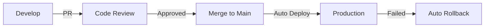

# Configuración de GitHub Actions para CloudEdu Services

Este directorio contiene los workflows de CI/CD para el proyecto CloudEdu Services.

## Workflows Disponibles

### 1. CI/CD Pipeline (`ci-cd.yml`)
Pipeline principal de integración y despliegue continuo.

**Triggers:**
- Push a `main` o `develop`
- Pull requests a `main`
- Manual (workflow_dispatch)

**Jobs:**
- **test**: Ejecuta pruebas unitarias, linting y análisis de cobertura
- **build**: Construye y publica la imagen Docker a ECR
- **deploy**: Despliega la aplicación en EKS (solo en main)
- **rollback**: Rollback automático en caso de fallo

**Secretos requeridos:**
- `AWS_ACCESS_KEY_ID`
- `AWS_SECRET_ACCESS_KEY`

### 2. Terraform Validation (`terraform.yml`)
Valida y planifica cambios de infraestructura.

**Triggers:**
- Cambios en archivos de `terraform/`
- Pull requests
- Manual

**Jobs:**
- **terraform-validate**: Valida sintaxis y formato
- **terraform-plan**: Genera plan de cambios (solo en PRs)

### 3. Security Scan (`security.yml`)
Escaneo de seguridad continuo.

**Triggers:**
- Push a cualquier rama
- Pull requests
- Semanal (domingos a medianoche)
- Manual

**Jobs:**
- **code-security**: Escaneo de código y dependencias
- **docker-security**: Análisis de imagen Docker
- **k8s-security**: Validación de manifiestos K8s
- **dependency-review**: Revisión de dependencias (PRs)

## Configuración

### Secrets de GitHub

Configurar los siguientes secrets en el repositorio:

```bash
# AWS Credentials
AWS_ACCESS_KEY_ID=<access-key-id>
AWS_SECRET_ACCESS_KEY=<secret-access-key>
```

### Variables de Entorno

Las siguientes variables están configuradas en los workflows:

```yaml
AWS_REGION: us-east-1
EKS_CLUSTER_NAME: cloudedu-services-eks
ECR_REPOSITORY: cloudedu-services-app
K8S_NAMESPACE: cloudedu-services
```

## Uso

### Despliegue Manual

Para ejecutar un despliegue manual:

1. Ve a Actions en GitHub
2. Selecciona "CI/CD Pipeline"
3. Click en "Run workflow"
4. Selecciona la rama y confirma

### Flujo de Trabajo Recomendado



#### Proceso:
1. **Desarrollo**: Trabajar en rama `develop` o feature branches
2. **Pull Request**: Crear PR hacia `main`
   - Ejecuta tests automáticamente
   - Valida Terraform
   - Escanea seguridad
3. **Merge**: Una vez aprobado, merge a `main`
   - Build automático
   - Deploy a producción
4. **Monitoreo**: Verificar estado del despliegue
   - Smoke tests automáticos
   - Rollback si falla

### Comandos Útiles

```bash
# Ver estado de los workflows
gh workflow list

# Ver ejecuciones recientes
gh run list

# Ver logs de una ejecución
gh run view <run-id> --log

# Re-ejecutar workflow fallido
gh run rerun <run-id>

# Ver secretos configurados
gh secret list
```

## Branch Protection

Recomendaciones de protección para `main`:

- ✅ Require pull request reviews (1 aprobación)
- ✅ Require status checks to pass
  - `test`
  - `terraform-validate`
  - `code-security`
- ✅ Require branches to be up to date
- ✅ Include administrators
- ✅ Require linear history

## Troubleshooting

### Error: kubectl no autorizado

```bash
# Verificar configuración de aws-auth en EKS
kubectl get configmap aws-auth -n kube-system -o yaml

# Añadir el rol del usuario de GitHub Actions
kubectl edit configmap aws-auth -n kube-system
```

### Error: ECR login failed

```bash
# Verificar permisos del usuario IAM
aws ecr describe-repositories
aws ecr get-login-password
```

### Error: Deployment timeout

```bash
# Verificar pods
kubectl get pods -n cloudedu-services
kubectl describe pod <pod-name> -n cloudedu-services

# Ver logs
kubectl logs -f deployment/cloudedu-app -n cloudedu-services
```

## Mejoras Futuras

- [ ] Añadir stage de staging antes de producción
- [ ] Implementar blue-green deployment
- [ ] Añadir pruebas de carga automatizadas
- [ ] Integrar notificaciones (Slack, Teams)
- [ ] Implementar GitOps con ArgoCD o Flux
- [ ] Añadir análisis estático de código (SonarQube)
- [ ] Implementar feature flags
- [ ] Añadir smoke tests más completos
